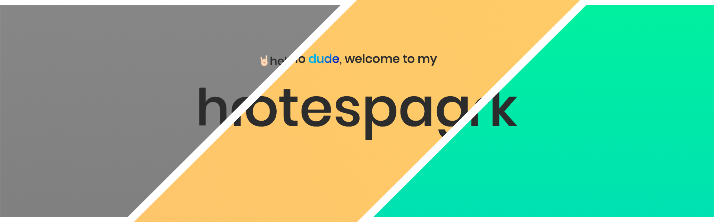

# Homepage | Notespage | Homework from WTF Co Ten Frontend
> This is a website that I design and code from the knowledge I get on WTF co ten frontend.

## Homepage
This site has very short section describing me, the guy who did this website. It also includes a simple form with a form checker nested.

## Notespage
WTF has 13 parts, every for every week. In every week there are a tons of lessons, links and important notes to concider. This site is like my notebook when I take notes.

## Homework
As mentioned before there are 13 weeks and at the end of every week we get a lot of homework to do.
